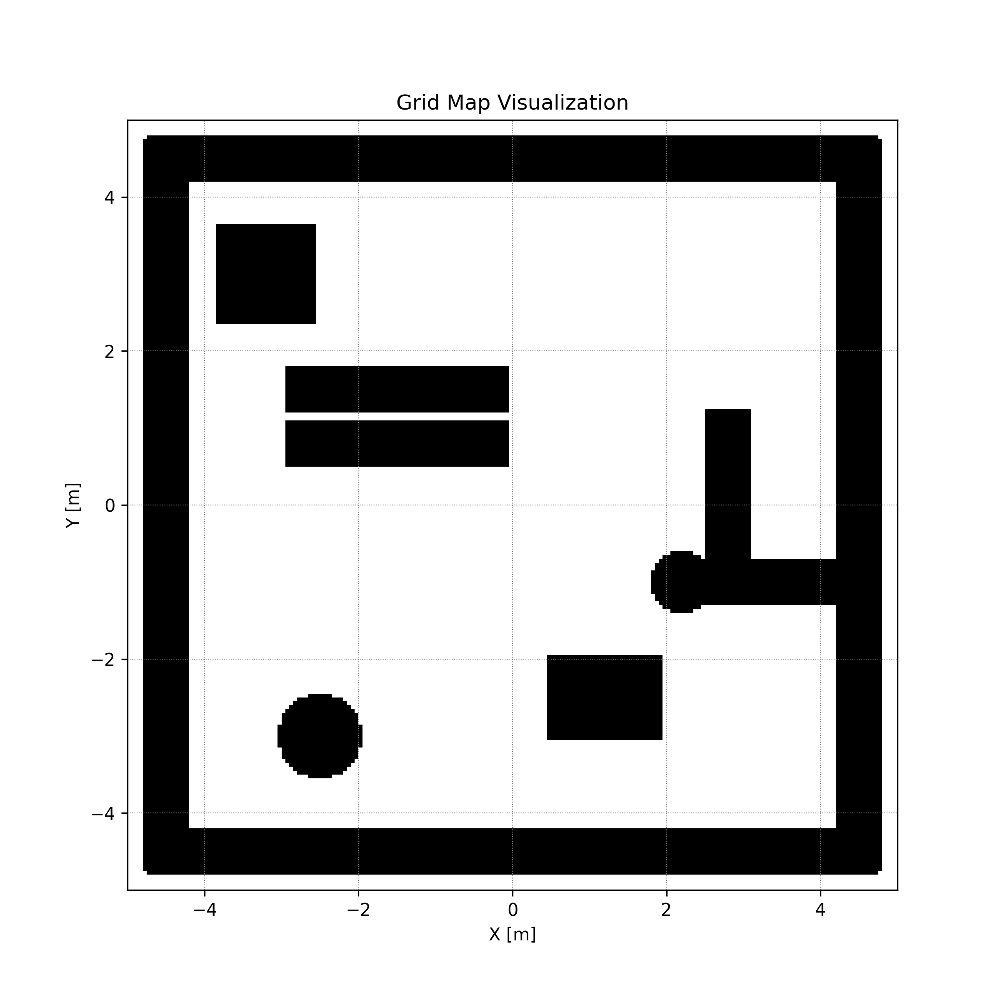
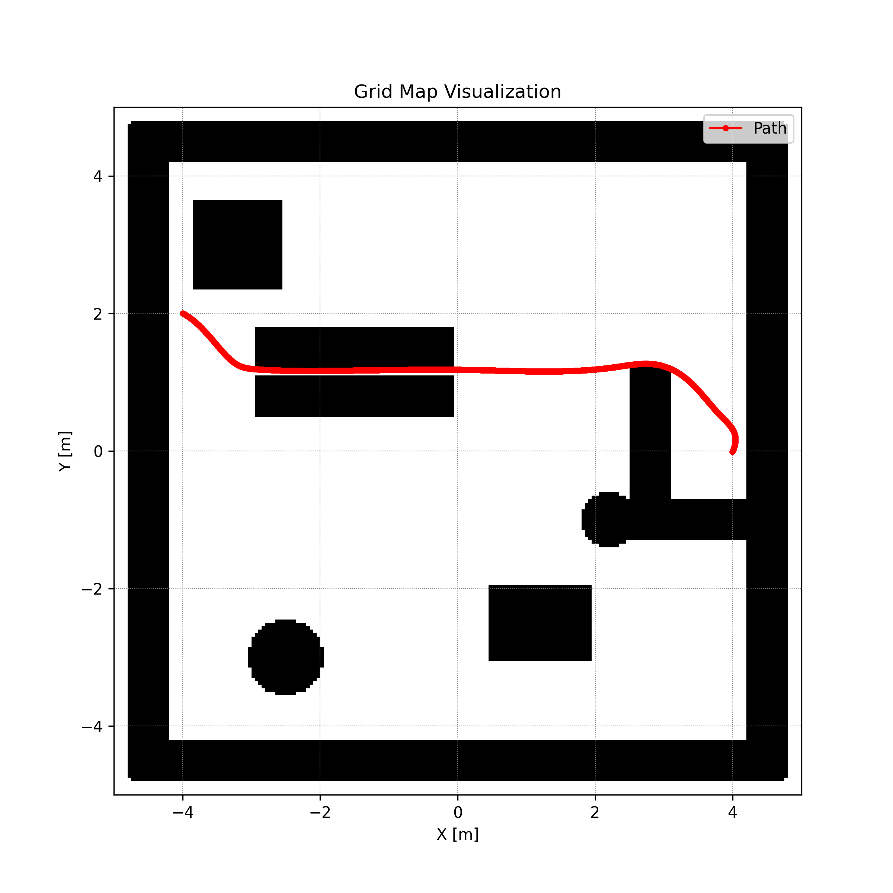

# MuJoCo Car Project

这是一个基于 MuJoCo 的差分驱动机器人仿真与控制研究项目。

## 项目概览

本项目实现了从物理仿真、环境封装到路径规划和控制器的完整技术栈：

- **`env/`**: 基于 MuJoCo 的物理仿真环境封装。
  - `DiffDrive_Env.py`: Gym 风格的环境接口。
  - `robot.py`: 机器人状态获取与底层控制 API。
- **`planning/`**: 路径规划算法。
  - `a_star.py`: 2D 网格地图上的 A* 算法。
  - `RRT/`: RRT 及其变体实现。
- **`control/`**: 控制器实现。
  - `mpc_casadi.py`: 基于 CasADi 和 IPOPT 的模型预测控制 (MPC)。
- **`utils/`**: 通用工具。
  - `gridmap_2d.py`: 2D 栅格地图构建与查询。

## 环境安装

本项目使用 [uv](https://github.com/astral-sh/uv) 进行依赖管理。

1. **安装 uv** : 以管理员身份打开PowerShell，执行：

   ```powershell
   powershell -ExecutionPolicy ByPass -c "irm https://astral.sh/uv/install.ps1 | iex"
   ```

2. **同步依赖**: 在项目根目录下运行：

    ```powershell
    uv sync
    ```

## 快速开始

可以使用 `uv run` 直接运行示例脚本来查看仿真效果：

### 1. A* 规划与 MPC 跟踪

演示在栅格地图上进行 A* 寻路，并使用 MPC 跟踪生成的路径：

```powershell
uv run test_a_star.py
```

|  |  |
|-------------------------------------|------------------------------------------------------|  

*左：原始栅格地图 | 右：A*规划路径（红色）与起点/终点（绿色/蓝色）*  

**演示视频**  
[![A*规划与MPC跟踪演示]](media/videos/A_Star_MPC.mp4)  

### 2. 其他示例

你可以探索项目根目录下的其他测试脚本：

- `test_dwa.py`: 动态窗口法 (DWA) 路径规划+ MPC跟踪。
- `test_rrt.py`: RRT 路径规划+ MPC跟踪。
- `test_mpc.py`: 单独的 MPC 跟踪测试。
